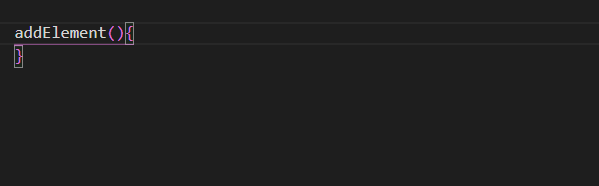

# Example

<!-- TOC -->

- [Script](#script)
- [Setup](#setup)
  - [Autocomplete](#autocomplete)
- [Allure Report](#allure-report)

<!-- /TOC -->

## Script

To execute a project script, use the command `npm run SCRIPT` with a script below:

| script             | action                                        |
| ------------------ | --------------------------------------------- |
| clean              | Remove all files generated by the execution   |
| spec:browser:spec  | Web - Run all specs files                     |
| spec:browser:file  | Web - Run a specific spec file                |
| spec:browser:suite | Web - Run a spec suite                        |
| spec:report        | Web - Generate a report site and open browser |
| spec:api           | Api - Run all specs files                     |
| feature:browser    | Web - Run all features files                  |

## Setup

### Autocomplete

Add the package `@types/webdriverio`:

```bash
npm install --save-dev @types/webdriverio
```

Now add the `tsconfig.json` with the content:

```json
{
  "compilerOptions": {
    "allowJs": true,
    "baseUrl": "./node_modules",
    "types": [
      "node",
      "@wdio/sync",
      "@wdio/mocha-framework"
    ]
  },
  "include": [
    "./test/**/*.js"
  ]
}
```

Now the autocomplete is enable



## Allure Report

[Allure Commandline](https://www.npmjs.com/package/allure-commandline) is a tool to generate Allure report from test results. Now you can get it installed directly from NPM.

Install the package:

```bash
npm install allure-commandline
```
